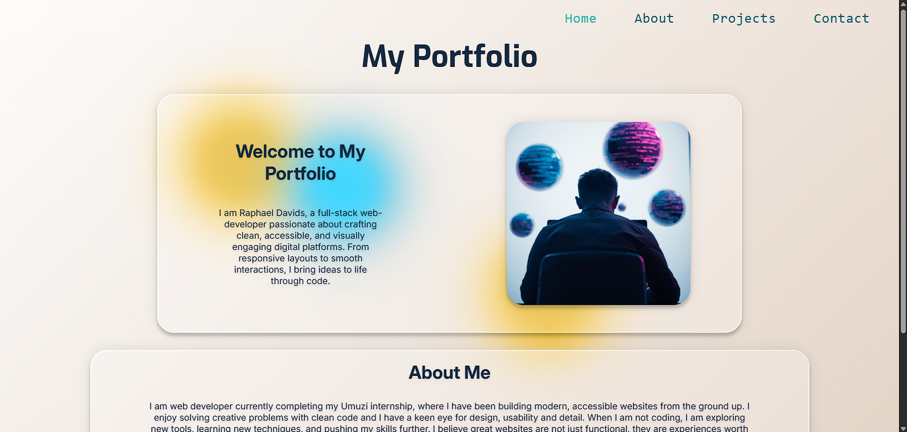
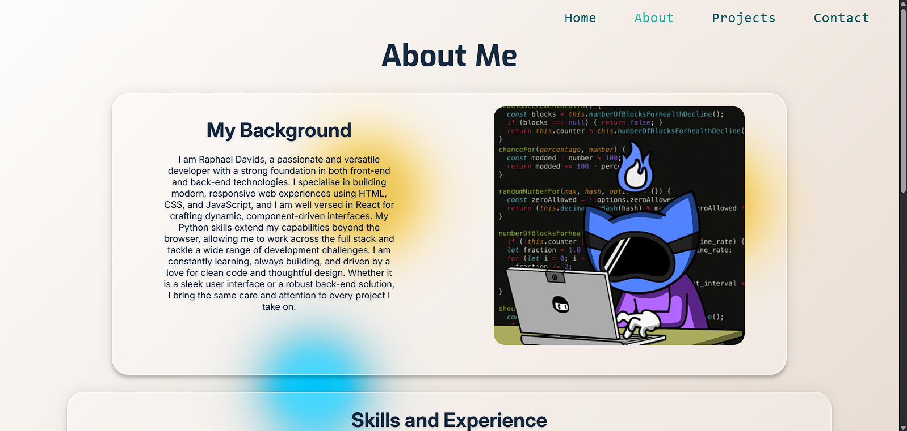
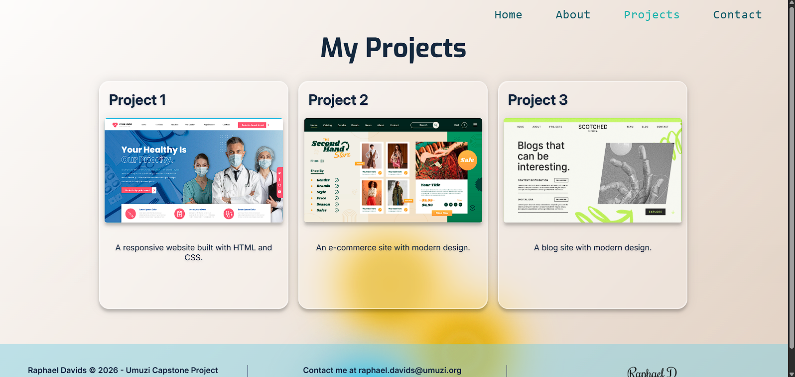
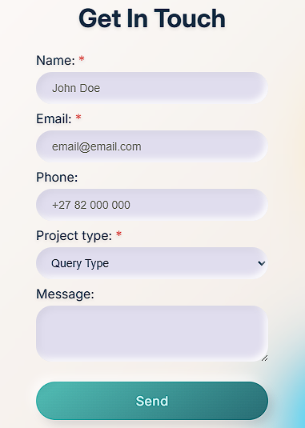
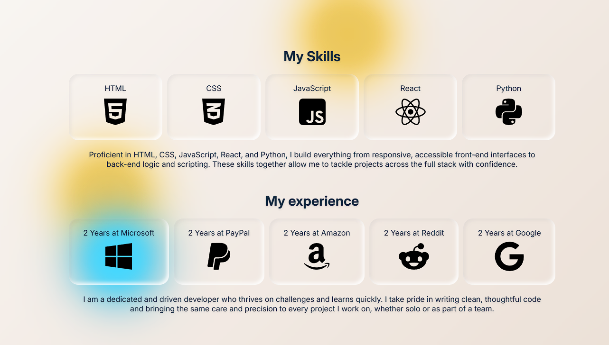
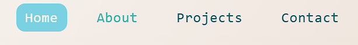

# Portfolio Website Overview

This is a four-page portfolio website template built for the Umuzi Capstone Project. The website features a home page with a short introduction, an about page with detailed background and skills information, a projects page showcasing past work, and a contact page allowing visitors to reach the person via a responsive form or direct links. The website is also fully responsive across all screen sizes.

The project began from an incomplete, error-filled starter codebase and was rebuilt into a fully functional, accessible, responsive, and professionally styled website.

**You can visit the Live URL here:** [https://bilodav.github.io/umuzi-capstone-project](https://bilodav.github.io/umuzi-capstone-project)

## What's Included

- `index.html` - Home page
- `about.html` - About page
- `projects.html` - Projects page
- `contact.html` - Contact page
- `css/styles.css` - Complete stylesheet
- `images/` - All images used across the site
- `design/wireframe.png` - Wireframe created during planning
- `design/issues-identified.txt` - Full list of errors found in the starter code
- `screenshots/` - Screenshots of all pages and features

## Issues Found

I have found that the starter codebase contained 42 identified errors. Some key issues included:

- No `css/` folder, `styles.css`, and also no `images/` folder were provided despite being listed in the project brief.
- All four of the HTML files were missing `lang="en"`, `charset`, `viewport`, and `description` meta tags.
- All structural elements used `
` instead of semantic HTML5 elements.
- No navigation bar existed on any page.
- No `aria-label`, `aria-current`, or `role` attributes were used anywhere.
- All images were missing `alt` attributes.
- The contact form had only 3 inputs, no labels, no validation, and an incorrect `type="text"` on the email field instead of `type="email"`.
- The about page was missing the skills table entirely.
- Projects page was missing the third project.
- CSS used only 2-3 selector types with no pseudo-classes, no box-model-demonstration, and a color contrast issue in the hero section.
- the footer was left aligned instead of centered.

Please see `design/issues-identified.txt` for the complete list of errors.

## Fixes Implemented

- Added `lang="en"`, all required meta tags, and Open Graph tags to all four pages.
- Replaced all `
` structural elements with correct semantic elements. I used `<header>`, `<nav>`, `<main>`, `<section>`, `<article>`, `<footer>` and `<address>`.
- I built a navigation bar across all four pages with `aria-label`, `aria-current="page"`, and `role="list"` for accessibility.
- I added descriptive `alt` text to all images.
- Built the missing skills and experience table on the about page using proper table elements with proper structure.
- Added a third project card to the projects page using the semantic `<article>` element.
- Rebuilt the contact form with 5 input types (text, email, tel, select, textarea), `<label>` elements for all inputs, and HTML5 validation attributes like `required`, `minlength` and `aria-required`.
- Redone the CSS, and used 5+ selector types, pseudo-classes, descendant selectors, and ID selectors.
- Fixed the footer alignment to centered using flexbox.
- Replaced the contrast-failing `lightblue` background in the hero with a design that meets the 4.5:1 contrast ratio requirement.
- I added responsive layout using CSS Grid, Flexbox, and media queries for mobile, tablet and desktop breakpoints.

## Final HTML Structure

Each page follows a consistent structure: `<header>` containing `<nav>` and `<h1>`, then a `<main>` containing `<section>` elements which will hold page-specific semantic tags. All pages also have a shared `<footer>`. Non-semantic `
` elements are limited to three and only used for the animated background orbs and the orb container.

## CSS Styling Approach

I defined custom CSS properties in `:root` for colors, fonts, gradients, and glass morphism values, keeping the code consistent and easy to update. Selector types used include element selectors, class selectors, ID selectors, descendant selectors, pseudo-classes, and pseudo-elements. Layouts are built with CSS Grid and Flexbox. Responsive breakpoints are applied at 300px, 768px, and 992px using media queries, Transitions and keyframe animations are used for the background orbs and interactive hover states.

## Accessibilty improvements

- Added `lang="en"` to all HTML elements for screen reader language detection.
- All images include descriptive `alt` text.
- All form inputs have associated `<label>` elements.
- I added `aria-required="true"` to all required form fields.
- I added `aria-label="Main navigation"` to all `<nav>` elements.
- I added `aria-current="page"` to the active navigation link on each active page.
- I added `role="list"` to the `<ul>` elements of the navigation bar.
- `aria-hidden="true"` is added to all the decorative elements.
- The required field markers are hidden from screen reader also using the `aria-hidden="true"`.

## How to view locally

1. Clone repository to your local machine.
2. Download and install the Live Server extension in VS Code.
3. Right-click the `index.html` page and select **Open with Live Server**.
4. The site will then open in your default browser at `http://127.0.0.1:5500`

## Screenshots

### Screenshots of All Four Pages.

#### Home Page (index.html)

#### About Page (about.html)

#### Project Page (projects.html)

#### Contact Page (contact.html)

### Form

### Table

### Navigation Hover State

## Reflection

The most challenging part of this project was working from a broken codebase rather than starting fresh. Identifying every error required careful reading of each file line by line. Learning which semantic HTML elements were good replacements for the standard `
` elements that were given, taught me how to make the HTML structure genuinely more meaningful. The CSS rebuild taught me the value of CSS custom properties for maintaining consistency across a large stylesheet. Implementing the glass morphism style with `backdrop-filter` and `::after` pseudo-elements required solving a pointer-events issue where the overlay was blocking clicks on child elements., which I had to research and then learned it can be resolved with `pointer-events: none`. Responsive design required careful thinking about which layouts needed explicit media queries and which could rely on flexbox `flex-wrap` to handle themselves naturally.
